# Capítulo IV: Product Design

## Style Guidelines
Esta sección constituye el pilar visual de OptiFlow, diseñado para proyectar una imagen de innovación tecnológica y precisión médica. El objetivo es estandarizar la interfaz para que tanto el personal de la óptica como el cliente externo perciban una plataforma robusta y profesional.

### General Style Guidelines
**Branding:**
El ecosistema visual de OptiFlow se centra en la convergencia entre la salud y la optimización de procesos. El logotipo principal utiliza una tipografía sans-serif de grosores variables para denotar dinamismo. El isotipo principal es un "ojo digital" formado por trazos circulares que simulan una lente y un sensor, representando el Probador Virtual y la Anamnesis Digital. Se han definido variaciones: una versión horizontal para el header de la web y una versión compacta (monograma) para aplicaciones móviles y favicons.

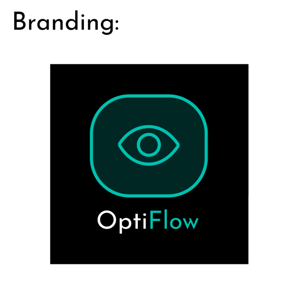{width=75%}

**Typography:**
Se ha seleccionado una familia tipográfica de corte tecnológico y alta legibilidad:
* Josefin Sans / Montserrat: Se utilizarán pesos Light para descripciones de beneficios y SemiBold para títulos de secciones y métricas en el Dashboard.

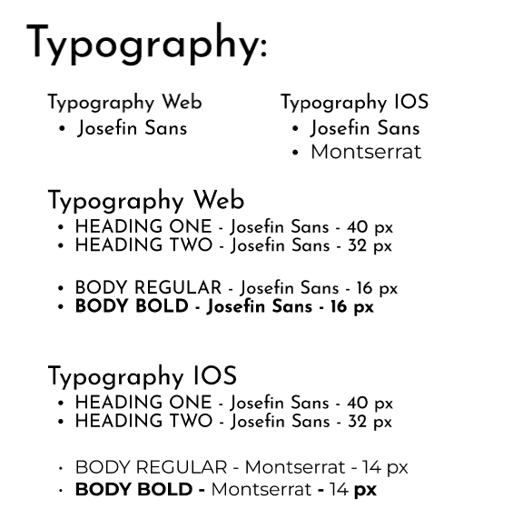{width=75%}

* Tono de comunicación: El sistema emplea un lenguaje Formal-Tecnológico. Se busca transmitir autoridad médica en el módulo clínico y eficiencia en el módulo de ventas, utilizando verbos de acción directa ("Confirmar Cita", "Finalizar Venta").

{width=75%}

**Colors:**
La paleta de colores se basa en una combinación de alto contraste para entornos
digitales, seleccionada bajo principios de modernidad y confianza:

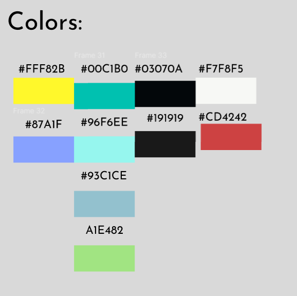{width=75%}

### Web Style Guidelines
Para la interfaz web responsive, se implementan los siguientes estándares de
interacción:

* Patrones de Lectura: Se aplica el Patrón F en los paneles administrativos para priorizar la lectura de datos del paciente a la izquierda..
* Componentes: Botones con bordes redondeados y estados de hover con degradados cian-verde.
* Responsive: Las métricas de ventas y el tablero Kanban se reorganizan en una sola columna en dispositivos móviles para mantener la operatividad del asesor de ventas en tienda.

{width=75%}

## Information Architecture

### Organization Systems
OptiFlow utiliza esquemas de organización lógica para manejar procesos complejos:

* Organización Jerárquica: Navegación adaptativa por roles. El Optometrista prioriza "Consultas", el Asesor prioriza "Ventas e Inventario", y el Dueño/Gerente accede al Dashboard de métricas y auditoría.
* Organización Secuencial (Step-by-Step): Crítica para el Onboarding Técnico (Registro -> Auth JWT -> Perfil) y el Flujo Logístico del Kanban (Pendiente -> Proceso -> Control Calidad -> Listo).

| Tópico | Definición |
| :--- | :--- |
| **Gestión de Pacientes** | Acceso centralizado a Historias Clínicas, consentimientos y deudas. |
| **Laboratorio Kanban** | Visualización del progreso de fabricación (Biselado, Montaje, Calidad) y gestión de urgencias SOS. |
| **Marketing y CRM** | Automatización de avisos WhatsApp, referidos y fidelización. |
| **Caja e Inventario** | Cierres de caja diarios, control de insumos y alertas de bajo stock. |
| **Seguridad Técnica** | Autenticación JWT, gestión de roles y auditoría de logs. |
| **Gerencia y BI** | Reportes de productividad, conversión de ventas y eficiencia. |
| **Recursos Humanos** | Control de asistencia, planes de adiestramiento de personal y gestión de vacantes. |

### Labeling Systems
Estandarización de etiquetas para alinear al equipo clínico, técnico y comercial:

| Etiqueta | Descripción |
| :--- | :--- |
| **Anamnesis** | Registro de antecedentes y motivo de consulta del paciente. |
| **SOS / Urgente** | Marcador visual rojo para priorizar órdenes en el Kanban. |
| **Rework** | Orden rechazada por Calidad que requiere re-procesamiento. |
| **Audit Log** | Registro histórico de cambios realizado por usuario para seguridad. |
| **Modo Offline** | Indicador de almacenamiento local por falta de conexión. |
| **Stock Crítico** | Alerta automática cuando el inventario baja del umbral. |
| **JWT Token** | Estado técnico de la sesión segura del usuario. |
| **Probar en vivo** | Acciona la cámara para el Probador Virtual (Magic Mirror). |
| **Historia Clínica** | Expediente digital del paciente y recetas de refracción. |
| **Stock / SKU** | Identificador único y cantidad de monturas/lentes. |

### SEO Tags and Meta Tags
Optimización para la Landing Page orientada a la captación de clientes:

* Title: OptiFlow - Gestión Integral para Ópticas y Laboratorios
* Meta Description: Digitaliza tu óptica con OptiFlow: Historias clínicas, probador virtual, control de inventarios y auditoría de laboratorio en tiempo real con seguridad JWT.
* Keywords: software ópticas, historia clínica digital, gestión laboratorio óptico, CRM óptico, receta digital, ERP óptica, API óptica.
* Author: OptiFlow Corp.

### Searching Systems
Filtros granulares para agilizar la operación diaria y la auditoría:

| Nombre del Filtro | Descripción |
| :--- | :--- |
| **Búsqueda por DNI/ID** | Localización inmediata del historial clínico, compras y estado de deudas. |
| **Estado de Orden** | Filtro por etapas del Kanban (Pendiente, Biselado, Montaje, Listo). |
| **Filtro de Material/SKU** | Búsqueda técnica de monturas (Titanio, Acetato) o cristales específicos. |
| **Estado de Pago** | Identificación de saldos pendientes para agilizar entregas (US15). |
| **Filtro de Auditoría** | Búsqueda por rango de fechas o usuario para revisar logs de seguridad y eficiencia. |

### Navigation Systems
Estructura de navegación diseñada para guiar al usuario hacia la resolución de metas.

| Sección | Descripción |
| :--- | :--- |
| **Dashboard** | Hub central con resúmenes críticos de ventas, inventario y citas del día. |
| **Módulo Clínico** | Acceso directo a Anamnesis, Recetas y Firma de Expedientes. |
| **Módulo de Órdenes** | Gestión de pedidos, calendario de entregas y cambio de estados logísticos. |
| **Portal Staff / RRHH** | Panel lateral para marcar asistencia, revisar adiestramientos y gestionar permisos. |
| **Configuración** | Ajustes globales de idioma, términos legales y preferencias de notificación. |
| **Gestión CRM** | Panel de fidelización, configuración de notificaciones automáticas y vinculación de órdenes con clientes. |
| **Seguridad y Acceso** | Centro de control de identidad: gestión de contraseñas, verificación de 2 pasos (2FA) y cierre de sesión. |

## Landing Page UI Design

### Landing Page Wireframe
[Wireframes de baja fidelidad de la landing page, mostrando la disposición de secciones y elementos.]

### Landing Page Mock-up
[Mock-ups de alta fidelidad de la landing page con diseño visual aplicado.]

## Web Applications UX/UI Design

### Web Applications Wireframes

#### US01 – Login

{width=100%}
{width=100%}

#### US02 – Recuperar Contraseña

{width=100%}
{width=100%}

#### US05 -

{width=100%}

#### US06 – Gestión de Perfil

{width=100%}

{width=100%}

#### US08 – Registro de historia clínica

{width=100%}

{width=100%}

#### US09 - Carga de Exámenes Externos
{width=100%}
{width=100%}

#### US10 – Registro de clientes

{width=100%}

#### US11, 13, 14 - Registro de venta, aplicación de descuentos, pagos con múltiples métodos

#### US15 Devolución de orden
{width=100%}
{width=100%}

#### US16 – Notificaciones de recojo

{width=100%}
{width=100%}

#### US17 - Encuestas de satisfacción
{width=100%}
{width=100%}

#### US23 – Control de Órdenes y Tablero Kanban

{width=100%}

{width=100%}

#### US34 - Registro de Empleado

{width=100%}

{width=100%}

#### US27 – Dashboard de Ventas

{width=100%}

{width=100%}

### Web Applications Wireflow Diagrams

#### US01 – Login

**Taskflow:**

{width=100%}

**Wireflow:**

{width=100%}

{width=100%}

#### US02 – Recuperar Contraseña

**Taskflow:**

{width=100%}

**Wireflow:**

{width=100%}
{width=100%}

#### US05

**Taskflow:**

{width=100%}

**Wireflow:**

{width=100%}

#### US06 – Gestión de Perfil

**Taskflow:**

{width=100%}

**Wireflow:**

{width=100%}

{width=100%}

#### US08 – Registro de Historia Clínica

**Taskflow:**

{width=100%}

**Wireflow:**

{width=100%}

{width=100%}

#### US09 – Carga de examenes externos
**Taskflow:**
{width=100%}

**Wireflow:**
{width=100%}
{width=100%}

#### US10 – Registro de clientes

**Taskflow:**

{width=100%}

**Wireflow:**

{width=100%}
{width=100%}

#### US-11F - Gestión de ventas, US-13F - Aplicación de descuentos, US-14F - Pagos con múltiples métodos
**Taskflow:**

{width=100%}

**Wireflow:**
{width=100%}
{width=100%}

#### US15 - Devolución de orden
**Taskflow:**
{width=100%}

**Wireflow:**
{width=100%}
{width=100%}

#### US16 – Notificaciones de recojo

**Taskflow:**

{width=100%}

**Wireflow:**
{width=100%}
{width=100%}

#### US17 - Encuestas de satisfacción
**Taskflow:**
{width=100%}

**Wireflow:**
{width=100%}
{width=100%}

#### US23 – Control de Órdenes y Tablero Kanban

**Taskflow:**

{width=100%}

**Wireflow:**

{width=100%}

{width=100%}

#### US-34G Registro de Empleado

**Wireflow:**

{width=100%}

{width=100%}

#### US27 – Dashboard de Ventas

**Wireflow:**

{width=100%}

{width=100%}

**Taskflow:**
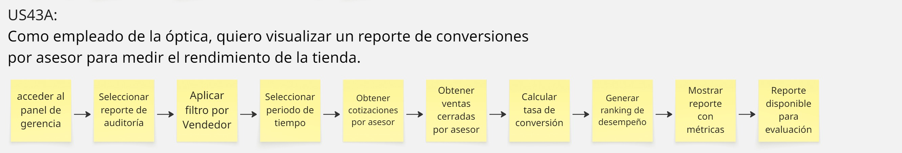

**Wireflow:**

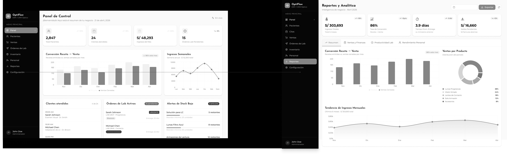

### Web Applications Mock-ups

#### US01 – Login

{width=100%}

{width=100%}

#### US02 – Recuperar Contraseña

{width=100%}
{width=100%}

#### US05 - Seguimiento de Orden Web

{width=100%}

#### US06 – Gestión de Perfil

{width=100%}

{width=100%}

#### US08 – Registro de Historia Clínica

{width=100%}

{width=100%}

#### US09 - Carga de exámenes externos
{width=100%}
{width=100%}

#### US10 - Registro de cliente
{width=100%}
{width=100%}

#### US-11F - Gestión de ventas, US-13F - Aplicación de descuentos, US-14F - Pagos con múltiples métodos
{width=100%}
{width=100%}

#### US15 - Devolución de orden
{width=100%}
{width=100%}
#### US16 - Notificaciones de recojo

{width=100%}

{width=100%}

#### US17 - Encuestas de satisfacción
{width=100%}
{width=100%}

#### US27 – Control de Órdenes y Tablero Kanban

{width=100%}

{width=100%}

#### Registro de Empleado

{width=100%}

{width=100%}

#### US27 – Dashboard de Ventas

{width=100%}

{width=100%}

### Web Applications User Flow Diagrams

#### US01 – Login

- **Happy Path:** El usuario ingresa credenciales válidas → el sistema autentica mediante JWT → se redirige al dashboard según el rol asignado.
- **Unhappy Path:** Credenciales incorrectas → mensaje de error de autenticación → el usuario puede reintentar o acceder a la opción de recuperar contraseña.

{width=100%}

{width=100%}

#### US02 – Recuperar Contraseña

- **Happy Path:** El usuario ingresa su correo registrado → recibe un enlace de restablecimiento → define una nueva contraseña → inicia sesión correctamente.
- **Unhappy Path:** El correo ingresado no existe en el sistema → mensaje de error → el usuario es dirigido al soporte o al registro.

{width=100%}

#### US05 Seguimiento de orden web

- **Happy Path:** El usuario completa el formulario con información válida → el sistema guarda los datos → confirmación exitosa mostrada en pantalla.
- **Unhappy Path:** Datos incompletos o inválidos → el sistema muestra errores de validación por campo → el usuario corrige y reintenta el envío.

{width=100%}

#### US06 – Gestión de Perfil

- **Happy Path:** El usuario accede a su perfil → edita los datos deseados → guarda los cambios → confirmación exitosa y perfil actualizado.
- **Unhappy Path:** El usuario intenta guardar con campos obligatorios vacíos → la validación impide el guardado → el sistema resalta los campos incompletos.

{width=100%}

{width=100%}

#### US08 – Nuevo Examen

- **Happy Path:** El optometrista selecciona al paciente → llena los campos de anamnesis y refracción → guarda el examen → el registro queda en la historia clínica del paciente.
- **Unhappy Path:** Datos de refracción fuera de rango o paciente no encontrado → alertas de validación → el sistema impide guardar hasta corregir los valores ingresados.

{width=100%}

{width=100%}

#### US09 - Carga de exámenes externos

- **Happy Path:** El optometrista accede al módulo de historia médica, completa los datos del examen externo y adjunta el archivo en formato válido → el sistema valida el archivo y lo sube correctamente → el examen queda registrado y vinculado al historial del paciente con confirmación de éxito.
- **Unhappy Path:** El archivo adjunto tiene un formato no compatible o los campos obligatorios están vacíos → el sistema muestra mensajes de error de validación resaltados en rojo → el usuario corrige los datos o selecciona un archivo válido antes de reintentar.

{width=100%}
{width=100%}

#### US10 - Registro de clientes

- **Happy Path:** El asesor abre el módulo de pacientes y selecciona "Agregar Paciente" → completa el formulario con todos los campos requeridos (nombre, DNI, datos de contacto) → el sistema guarda el registro y muestra la confirmación de paciente creado exitosamente.
- **Unhappy Path:** Se intenta guardar el formulario con campos obligatorios vacíos o con datos duplicados (DNI ya registrado, correo inválido) → el sistema resalta los campos con error en rojo e impide el guardado → el usuario corrige los datos y vuelve a intentar el registro.

{width=100%}
{width=100%}

#### US-11F - Gestión de ventas, US-13F - Aplicación de descuentos, US-14F - Pagos con múltiples métodos

{width=100%}
{width=100%}
- **Happy Path:** El asesor inicia una nueva nota de venta seleccionando al cliente → agrega los productos al detalle de la orden → aplica un descuento válido si corresponde → elige uno o más métodos de pago que cubren el total → el sistema procesa el pago y confirma la venta registrada exitosamente.
- **Unhappy Path (US11):** No se selecciona ningún producto o el stock disponible es insuficiente → el sistema bloquea el avance al paso siguiente y muestra la alerta de inventario. **Unhappy Path (US13):** El descuento ingresado supera el límite permitido para el rol del asesor → el sistema rechaza la aplicación del descuento. **Unhappy Path (US14):** La suma de los montos ingresados en los métodos de pago no cubre el total de la venta → el sistema indica el saldo pendiente e impide finalizar la transacción.

#### US15 - Devolución y cancelación de orden

{width=100%}
{width=100%}

- **Happy Path (cancelación):** El asesor localiza la orden activa en la lista de ventas y selecciona la opción de cancelar → confirma la acción en el modal de "Confirmar Cancelación" → el sistema anula la orden y muestra la pantalla de confirmación "Producto devuelto".
- **Happy Path (devolución):** El asesor localiza una orden con estado "Completada" y selecciona "Devolución" → el modal muestra los detalles del cliente y el monto a reembolsar → el asesor confirma → el sistema procesa la devolución y muestra "Devolución efectuada".
- **Unhappy Path:** La orden se encuentra en un estado incompatible con la cancelación o devolución (ya cancelada, en producción o fuera del plazo permitido) → el sistema deshabilita la acción o muestra un mensaje de restricción que impide continuar.

#### US16 – Notificaciones a Clientes

{width=100%}

{width=100%}

- **Happy Path:** El sistema detecta un evento (entrega lista, pago pendiente) → genera y envía la notificación por el canal configurado → el cliente la recibe correctamente.
- **Unhappy Path:** Canal de contacto no registrado o número inválido → la notificación se marca como fallida → aparece en el panel de incidencias para seguimiento manual.

#### US17 - Encuestas de satisfacción
{width=100%}
{width=100%}
- **Happy Path:** El sistema detecta la orden recibida, envía el cuestionario y luego el usuario tiene la opción de responder los cuestionarios que siguen o cancelar.
- **Unhappy Path:** Sucede cuando el usuario trata de continuar con la encuesta sin haber responido los campos necesarios.

#### US27 – Control de Órdenes y Tablero Kanban

- **Happy Path:** El técnico mueve la orden entre columnas del Kanban (Pendiente → Biselado → Montaje → Control de Calidad → Listo) → cada cambio queda registrado en el historial.
- **Unhappy Path:** La orden falla en Control de Calidad → se marca como "Rework" → regresa a la fase de procesamiento con una nota de rechazo visible en el tablero.

{width=100%}

{width=100%}

#### US-34 Registro de Empleado

- **Happy Path:** El administrador completa el formulario de registro → asigna roles y permisos → el sistema crea la cuenta y envía las credenciales al empleado por correo.
- **Unhappy Path:** DNI o correo ya registrado en el sistema → error de duplicado → el administrador verifica y corrige los datos antes de reintentar.

{width=100%}

{width=100%}

#### US27 – Dashboard de Ventas

- **Happy Path:** El gerente accede al dashboard → visualiza métricas de ventas, conversión y rendimiento en tiempo real → puede filtrar por período, área o asesor.
- **Unhappy Path:** Sin datos suficientes para el período seleccionado → el dashboard muestra un estado vacío con indicaciones para ampliar el rango de fechas o verificar la fuente de datos.

{width=100%}

{width=100%}

## Web Applications Prototyping

https://www.figma.com/design/Pa0pYLdGRk2dqT8JHkb6Sw/OptiFlow-Figma?node-id=317-12353&t=rHKoqaawtu3y1jy5-1

## Domain-Driven Software Architecture

### Design-Level Event Storming
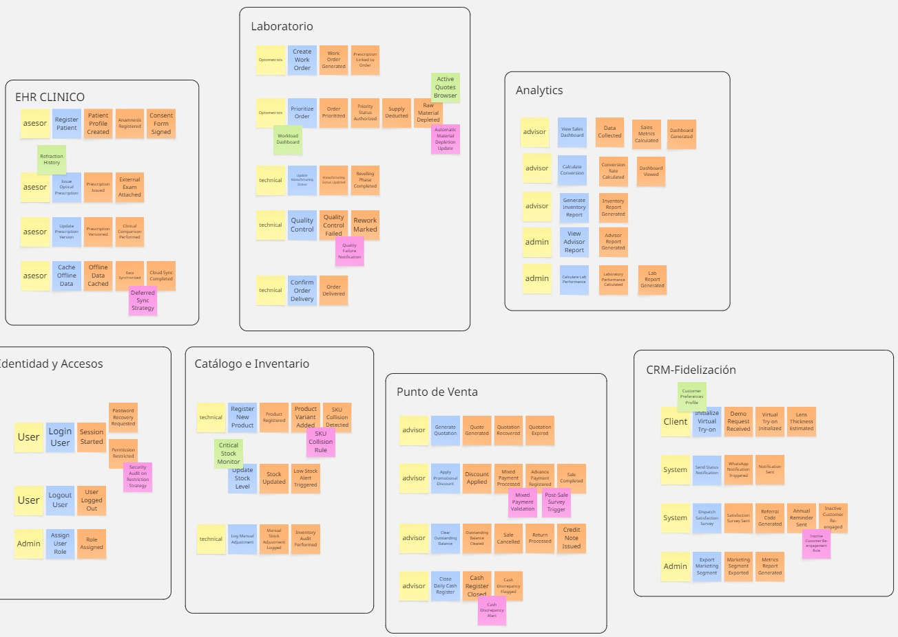{width=100%}

### Software Architecture Context Diagram
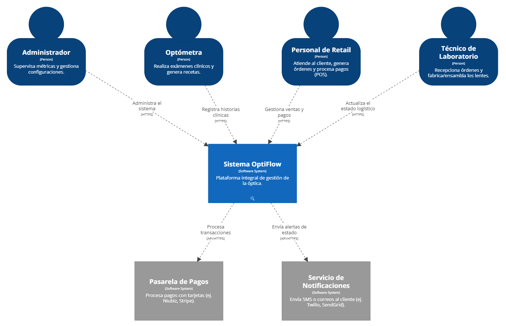{width=100%}

### Software Architecture Container Diagrams
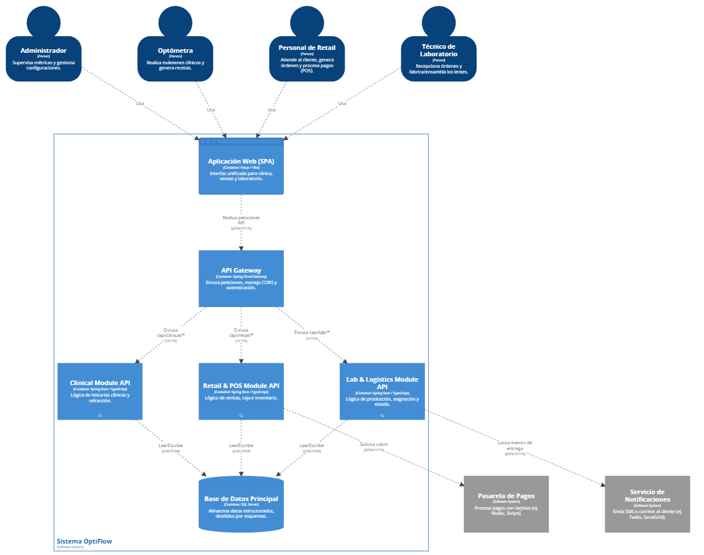{width=100%}

### Software Architecture Components Diagrams
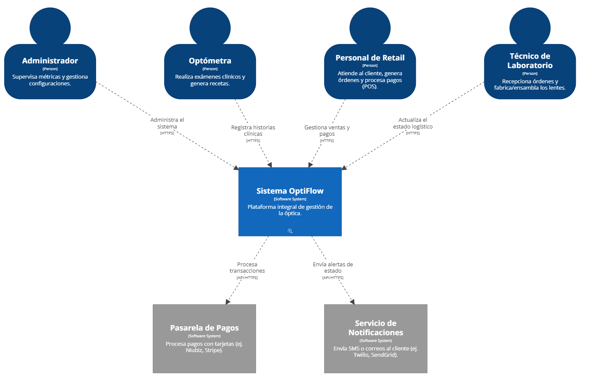{width=100%}

#### Clinical Module
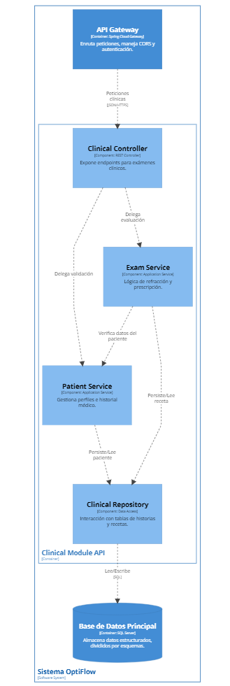{width=100%}

#### Retail Module
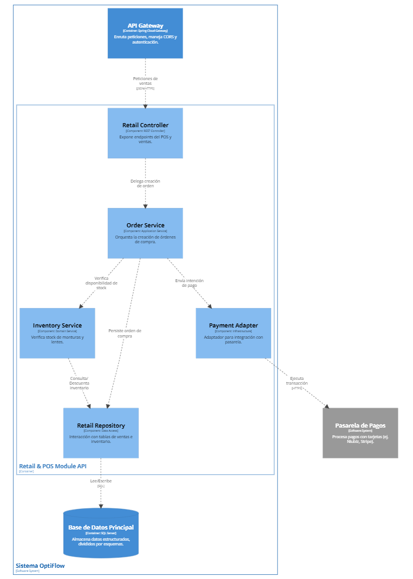{width=100%}

#### Lab Module
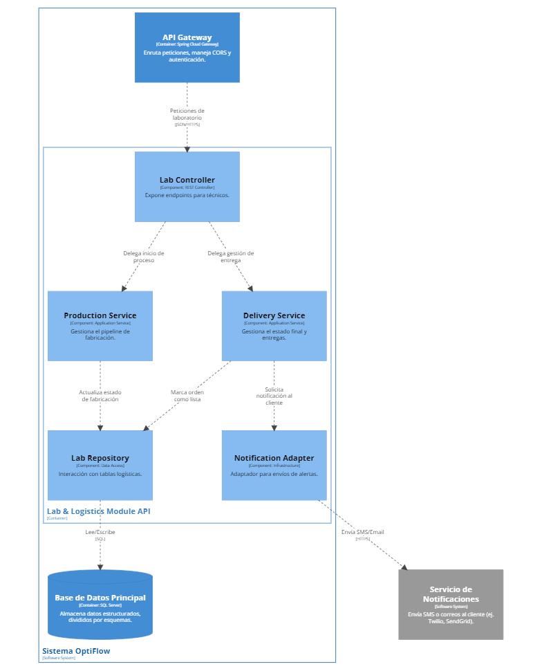{width=100%}

## Software Object-Oriented Design

### Class Diagrams
[Diagramas de clases UML con atributos, métodos y relaciones entre entidades del dominio.]

## Frontend Class Diagrams
### IAM (Identity and Access Management)

### Clinical (Gestión Clínica y Optometría)

### Sales (Ventas y CRM)

### Order Fulfillment (Laboratorio y Producción)

### Inventory (Inventario y Suministros)

### Analytics (Métricas y Reportes)

### App (Componentes Compartidos y Core)

## Backend Class Diagrams

### Analytics & Shared

### Clinical, Sales & Billing

### IAM & Clinical

### Inventory & Sales

### Order Fulfillment & CRM

### Sales & Order Fulfillment

## Database Design

### Database Diagrams

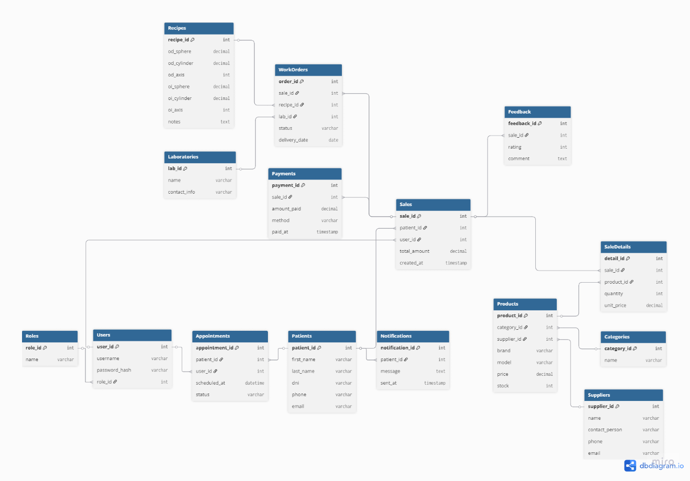{width=100%}